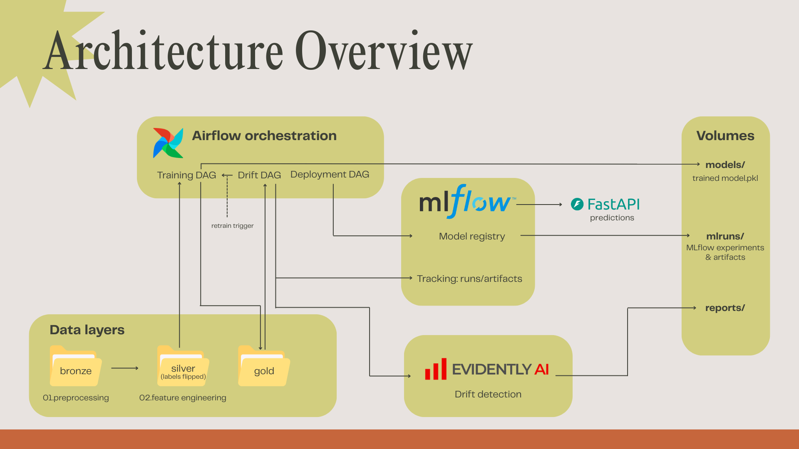

# Architecture Overview

This project implements an end-to-end MLOps workflow for a student-performance classifier using a **bronze → silver → gold** data layout, **Airflow** for orchestration, **MLflow** for experiment tracking & model registry, **Evidently** for drift detection, and **FastAPI** for serving.

## Components

### Data layers
- **bronze/** – raw CSV pulled from Google Drive (reproducibility).
- **silver/** – preprocessed dataset (**Pass/Fail** labels flipped).
- **gold/** – feature-engineered splits (train/val/test).

### Airflow orchestration
- **Training DAG** – preprocess → feature engineering → train → evaluate; logs runs/artifacts to MLflow and saves `models/model.pkl`; registers candidate in the MLflow Registry if guardrails pass.
- **Deployment DAG** – checks latest **Staging** model in the Registry, validates metrics/constraints, and promotes/demotes to **Production**.
- **Drift DAG** – scheduled Evidently check comparing **reference** (gold) vs **current/drifted** (silver); writes `reports/drift_report.json`, logs to MLflow, and can trigger retraining.

### MLflow
- **Tracking** – runs, params, metrics, and artifacts stored locally in `mlruns/` (or remote if configured).
- **Model Registry** – manages versions and stages.

### Evidently
- Uses `DataDriftPreset` via `src/drift_detection.py` to compute dataset- and feature-level drift; outputs `reports/drift_report.json`.

### Serving (FastAPI)
- Loads the **Production** model from the MLflow Registry (or `models/model.pkl` as a simple fallback) and exposes `/predict` and `/docs`.

### Volumes
- **models/** – trained `model.pkl`
- **mlruns/** – MLflow experiments & artifacts
- **reports/** – evaluation outputs and `drift_report.json`

## End-to-end flow (summary)
1. **Ingest & prep:** Bronze → Silver (labels flipped) → Gold (splits).  
2. **Train & evaluate:** Training DAG logs to MLflow; saves model artifact; registers candidate.  
3. **Deploy:** Deployment DAG promotes/demotes in the Registry; FastAPI loads the **Production** model.  
4. **Monitor:** Drift DAG runs Evidently; logs drift; can trigger retraining when thresholds are exceeded.